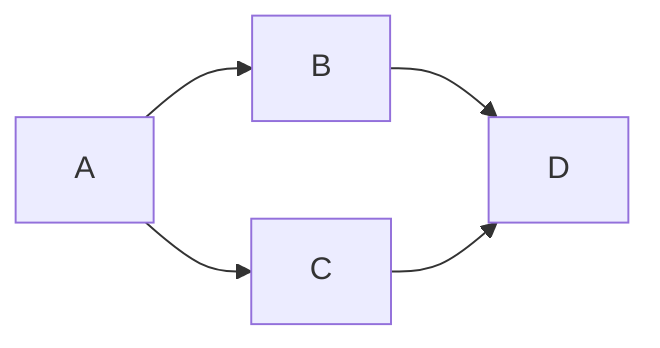
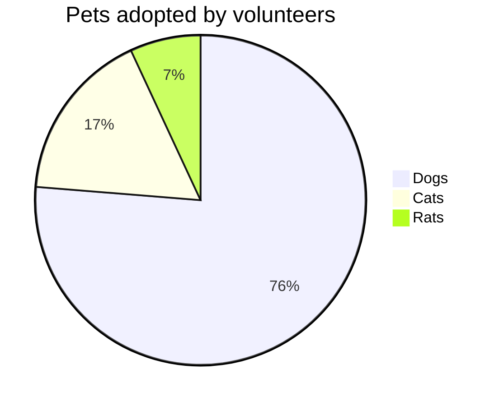
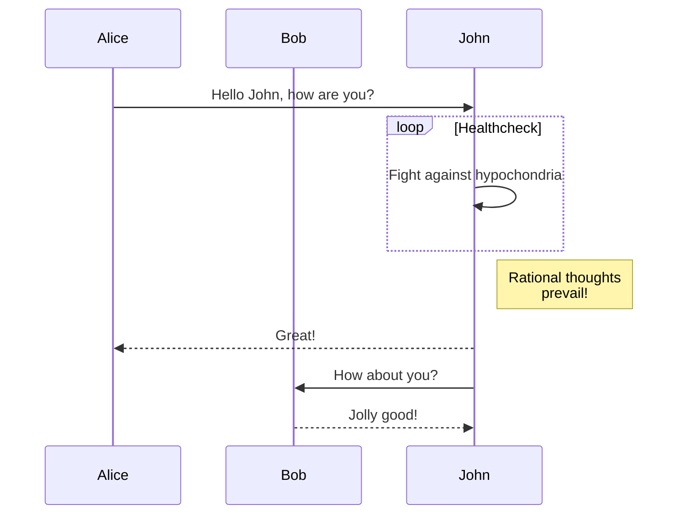

# github-experiments
Experiments with GitHub Actions, etc.

Hot off the press in February 2022!

* github/roadmap#372
* [Include diagrams in your Markdown files with Mermaid | The GitHub Blog](https://github.blog/2022-02-14-include-diagrams-markdown-files-mermaid/)

Here is a simple flow chart:

Git graph

Pie chart

Sequence diagram

